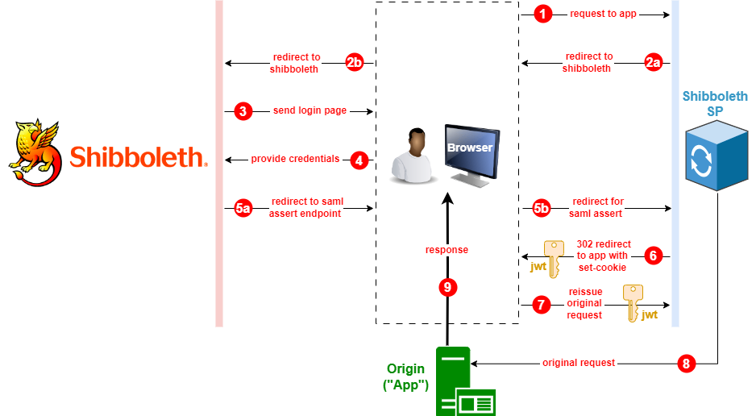

# Shibboleth-SP

Shibboleth-SP is a [nodejs](https://nodejs.org/en) [typescript](https://www.typescriptlang.org/) library that provides all service provider functionality for an application that must authenticate with a shibboleth IDP.

Basically, it acts as an **authentication proxy** that sits in front of your application and inspects incoming http request headers for [jwts](https://jwt.io/introduction) *(that it initially issued)* that provide evidence of an authenticated status. 

Requests are processed using the [saml2-js](https://www.npmjs.com/package/saml2-js) library to either verify authenticated status or drive the authentication process with the shibboleth IDP to get authenticated before passing through to the targeted application.

### Authentication flow:




This flow depicts the first of two modes that shibboleth-sp can be deployed to operate in:

1. **Basic mode:**
   In this mode, shibboleth-sp "decides" if authenticated access to the application is required. It does this on the basis of whether or not the jwt token is present, valid, and not expired. Requests that pass this test are sent through to the destination. Requests that fail this test trigger the saml flow depicted above at step 2. The application in this scenario is taking a hands-off approach to authentication and need not "know" at all that it is participating in a secure setup. This scenario would fit a minority of cases where the application requires all endpoints to be secured. 

2. **Standard mode:**
   In this mode, the application "decides" if authenticated access applies to the incoming request. It does this on whatever basis its business rules require. For this to work, shibboleth-sp will still inspect every request for a valid token, but instead of taking action upon finding an expired or missing jwt, it simply "tags" the request by appending an "authenticated" header with a "false" value and sends the it through. If the application deems the requested endpoint to require authenticated access, it finds the header is "false", and redirects back to the **`"/login"`** endpoint. Shibboleth-sp recognizes this endpoint to be one of its reserved "verbs" and will take action upon it by starting the the authentication flow as depicted in the diagram above at step 2. In this scenario, the application needs to be aware of 3 reserved headers:

   1. The name of the header *("authenticated")* that defines the incoming request as authenticated or not.
   2. The name of the header that specifies the shibboleth-sp reserved endpoint for initiating login.
   3. The name of the header that specifies the shibboleth-sp reserved endpoint for initiating logout.

   These headers are defined in the configuration section below.

### Topology:

The shibboleth-sp library is used anywhere it can intercept http traffic:

- **Inside the application** as added tooling.
  This assumes the app itself runs an http server and is in javascript with node package management.
- **On the application server** as part of the internal reverse proxying, like an [nginx](https://nginx.org/en/)/[express](https://expressjs.com/) setup that routes to your app.
  Here the app need not be restricted to nodejs.
- **External to the application server**. An example of this would be using shibboleth-sp in a [lambda@edge](https://docs.aws.amazon.com/lambda/latest/dg/lambda-edge.html) function as part of a [cloudfront distribution](https://docs.aws.amazon.com/AmazonCloudFront/latest/DeveloperGuide/distribution-working-with.html). Your app would be deployed somewhere behind a load-balancer, and cloudfront would carry out authentication.

### Configuration:

The `./src/Config.ts` module defines how shibboleth-sp is configured:

- **domain**: string *(env: DOMAIN, default: "localhost")*, The domain for requests to your app that shibboleth-sp is "listening" to.
- **appLoginHeader**: string *(env: APP_LOGIN_HEADER)*, The name of a header shibboleth-sp will apply to requests. Apps will look for this header when redirecting for login.
- **appLogoutHeader**: string *(env: APP_LOGOUT_HEADER)*, The name of a header shibboleth-sp will apply to requests. Apps will look for this header when redirecting for logout.
- **appAuthorization**: boolean *(env: APP_AUTHORIZATION, default: "true")*, True indicates the standard mode as described in the authentication flow section above. False indicates the basic mode as described in the authentication flow section above.
- **appPort**: string|number *(env: APP_PORT, default: "8080")*, Applies to running locally with docker compose.
    This is the port that the "app" container will expose and the "sp" container will proxy to using axios requests.
    Use "443" if you want the "app" container to expect https traffic and use ssl.
-  **samlParms**:
    - **entityId:** string *(env: ENTITY_ID)*, The entity ID of your app know to shibboleth. Example: `'https://*.myapp.bu.edu/shibboleth'`
    - **entryPoint:** string *(env: ENTRY_POINT)*, The entry point, aka IDP address of shibboleth: Example: `'https://shib-test.bu.edu/idp/profile/SAML2/Redirect/SSO'` 
    - **logoutUrl:** string *(env: LOGOUT_URL)*, The logout url used by the IDP. Example: `'https://shib.bu.edu/idp/logout.jsp'`
    - **idpCert:** string, *(env: IDP_CERT)*, The public cert of the IDP. Navigate to the IDP entry point in a browser and acquire this cert from the `'<ds:X509Certificate>'` element.
    - **cert:** string, *(env: SAML_CERT)*, The SAML certificate item of your service provider metadata.
    - **key:** string, *(env: SAML_PK)*, The private key item of your service provider metadata.
- **jwtPrivateKeyPEM**: string *(env: JWT_PRIVATE_KEY_PEM, default: read on...)*, A private key for JSON web token (JWT) generation. If not provided, one will be generated that lasts as long as the application process is running, which would make sense in a testing scenario.
- **jwtPublicKeyPEM**: string *(env: JWT_PUBLIC_KEY_PEM, default: read on...)*, A public key for JSON web token (JWT) generation. If not provided, one will be generated that lasts as long as the application process is running, which would make sense in a testing scenario.
- **customHeaders**: *KeyValuePair[]*, A way to inject those headers that one wishes sp-shibboleth to append to incoming reqests. Currently not available as environment variable(s). 

### Publishing and Installing:

For and example of how this project can be packaged and then installed and used by another project, see [Publishing and Installing](./docs/publish-and-install.md)

### Running Locally

For directions on how to run this app locally, including step debugging, see [Running Locally](./docs/run-locally.md)

### Unit Tests

To run any and all jest tests *.test.ts, use:

```
npm run test
```

